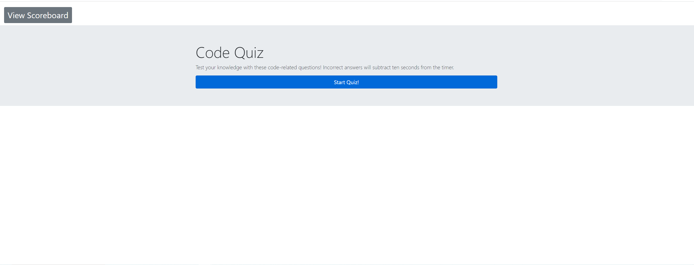
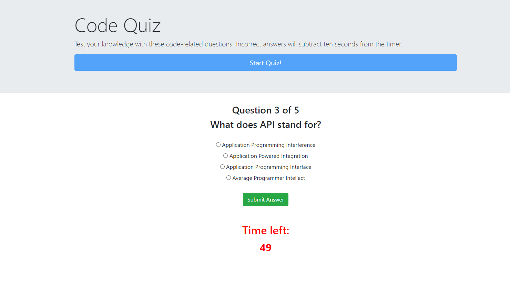
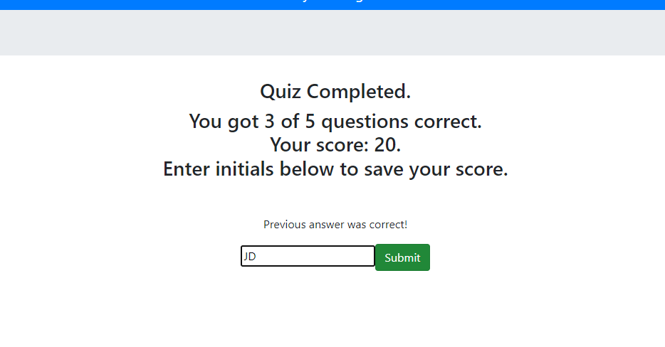
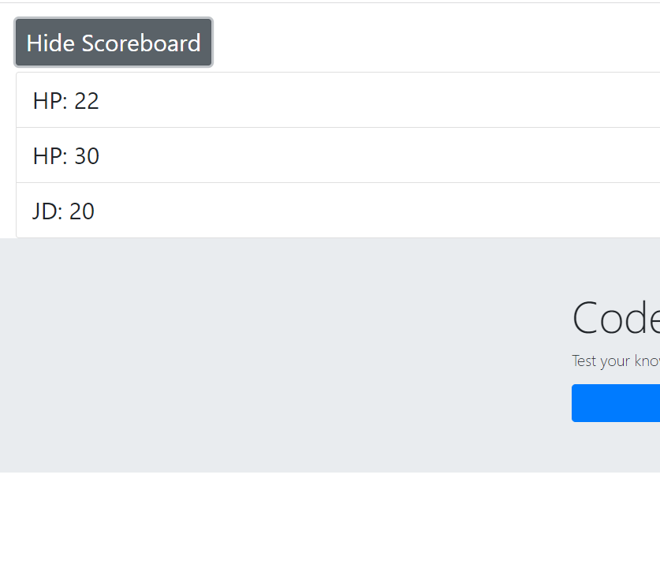

# Code Quiz

 ## Purpose

 Allow user to take a simple quiz of coding-related questions.

 ## Details

 Upon clicking "Start Quiz", a timer is started and the user is run through a short quiz in which they may select an answer to each question. Incorrect (or unanswered) questions subtract 10 seconds from the timer.After clicking through all the questions, user is presented with a score equal to seconds remaining on timer. User is able to input their initials to save their score, as well as view a scoreboard containing previous attempts.

 ## Screenshots
 
 
 
 

 ## Link
 https://hannahj25.github.io/code-quiz/

 ## Future considerations
 
 - Add more and better questions! Depending how many, make timer longer.

 - Ideally scores would be sorted with highest at the top, lowest at the bottom.

 - Answer selection is slow because user has to click to select an answer, then click submit. And the radio inputs are small and difficult to accurately click. This isn't ideal for a timed quiz. Buttons would be better.

 - There is a delay on the timer starting after the quiz displays; the best workaround I could find for now was having my timer text display (from the HTML) as 60, but set my actual timer as 59. So it shows 60, delays, then shows 59 and counts down from there. Not perfect as on 'Play Again' it will then first show whatever time was remaining after the prior attempt at the quiz before counting down from 59.

 - I would like to modify the scoring system so points are also added for each correct answer.

 - The overall styling could be a lot nicer. Bootstrap's modal component may be a better option for displaying the scoreboard. Also style the "Previous answer was..." to fade away.

 ## Acknowledgements
 
 Used Bootstrap for styling.

 Much of the base for the JavaScript code which runs the quiz was taken from this tutorial: https://www.codemahal.com/video/javascript-quiz-tutorial/. I adapted it to suit my purposes and added extras e.g start button, timer, allowing user to save score, view scoreboard, etc.

